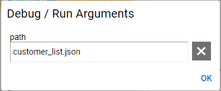

# Frequently Used Actors

Now that you know how to work with Actors, let's explore the different types of built-in Broadway Actors and learn about the most frequently used ones.

For an overview on built-in Broadway Actors, please read [Built-in Actor Types](/articles/19_Broadway/04_built_in_actor_types.md). 

Let's take a closer look at some of the most useful Actors.

* Dynamic Logic Actors are Actors that include dynamic logic as one of their input parameters. The most frequently used are:
  * **JavaScript** Actors, that simplify flows by writing JavaScript business logic or validation code in the **script** input parameter.
  * **DB Commands** Actors, that perform DB commands and actions like creating a new table, loading data, etc.

* Other Actors for handling useful activities are:
  * **Stream** Actors, that handle streams like reading from and writing to a file or compressing and decompressing data.
  * **Parser** Actors, that parse input streams into different formats like JSON, CSV and XML.
  * **Queue** Actors, that manage Pub / Sub asynchronous message handling.

To learn more about the above Actors, their specifications and examples, read [Actor Specifications and Examples](/articles/19_Broadway/actors/README.md). 

### Example - Reading and Parsing a File

Let's create a new Broadway flow that reads data from a JSON file, parses it and prints it into a log. Use the JSON file you created in the [Building a Simple Broadway Flow](05_create_broadway_flow.md#example---building-a-simple-broadway-flow) example as an input file.

1. Create a new Broadway flow as explained in the [Building a Simple Broadway Flow](05_create_broadway_flow.md#example---building-a-simple-broadway-flow) example.

2. Add a **FileRead** Actor to Stage 1 of the flow and populate its input arguments as follows:

   * Set **Interface** to **LocalFileSystem**. If this Interface has not been defined in Fabric, follow the instructions in the [Building a Simple Broadway Flow](05_create_broadway_flow.md#example---building-a-simple-broadway-flow) example.

   * Change the **path** population type to **External**. 

   * To populate the **path** value, click **Actions** > **Debug / Run Arguments** in the [Main menu toolbar](/articles/19_Broadway/18_broadway_flow_window.md#main-menu). 

     

     To learn more, refer to [Setting Run and Debug Arguments](/articles/19_Broadway/25_broadway_flow_window_run_and_debug_flow.md#setting-run-and-debug-arguments).

3. Add a **JsonParser** Actor to Stage 2 of the flow and connect its input argument to the previous Actor's output. 

   * Set the **single** input argument to correspond with the input JSON file. If the input file includes a valid JSON file, keep the value as **true**. However, if the input file includes an array of JSON objects, set the value to **false**.

4. Add a **Logger** Actor to Stage 3 and populate its input arguments as follows:

   * Change the **message** population type to **Const**. 
   * Set the **message** value to: *There are ${NUM_OF_CASES} cases with Status = ${CASE_STS}*.
   * Check that the new input arguments are added to the Actor: NUM_OF_CASES and CASE_STS.

5. Click  adjacent to the Actor's output argument to open the yellow Data Inspection segment and display the Schema on the left and the data values on the right. 

6. Connect the fields in the yellow segment to the **Logger** Actor's new input arguments and set their **Link Type** to **Iterate**. 

   To learn more about the Data Inspection and the Link Types, refer to [Broadway Data Inspector](/articles/19_Broadway/27_broadway_data_inspection.md) and [Linking Actors](/articles/19_Broadway/07_broadway_flow_linking_actors.md).

7. The flow is ready! Make sure the input file exists in the designated working directory and run the flow. 

   * Run the flow in Debug mode when Debug is set to  ON.

   

     To learn more about Debug options, refer to [Run and Debug Broadway Flow](/articles/19_Broadway/25_broadway_flow_window_run_and_debug_flow.md).

8. Check the output log area to see the printed results.

9. Change the following:

   * Set the **message** value of  the **Logger** Actor to: *There are ${0} cases with Status = ${1}*.
   * Connect the **[object]** output argument of the **JsonParser** Actor directly with the **[params]** input argument of the **Logger** Actor. 
   * Set the **Link Type** to **Iterate**.

10. Run the flow again and verify that the result is identical.

    

