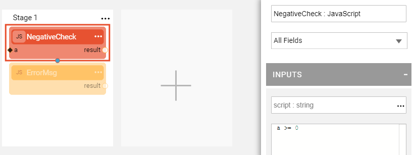

# Examples of Broadway Additional Features

### Example 2 - Inner Flow and Error Handling

**Part 1 - Error Handling**

1. Create a new Broadway flow **CheckNegative**.

2. Click > **Error Handler** in the Stage context menu of Stage 1 to select a **JavaScript** Actor and write the following validation in the **script** input argument:

   ~~~javascript
   a >= 0;
   ~~~

3. Add a new input argument **a** and set it as **External**.

4. Add another **JavaScript** Actor to the same Stage and write the following script to it:

   ~~~javascript
   throw "Can't be negative!"
   ~~~

5. The flow is ready and you can run it with different input arguments (positive and negative) to validate the results. 

   

6. When the input is negative, the following error message is thrown:

   

**Part 2 - Save a Flow as an Actor**

1. Click **Save as Actor** from the Main menu toolbar in order to save the current flow as an Actor and use its logic as an inner flow in another Broadway flow.

2. Populate the tag (category) name, for example **validatationChecks** and click **SUBMIT**. 

3. The new category **validatationChecks** is added and it holds a **CheckNegative_Actor** Actor.

**Part 3 - Use an Inner Flow in a Flow**

1. Create an additional Broadway flow.

2. Add a **Const** Actor to Stage 1 and set the **value** = **1**. 

3. Add a **CheckNegative_Actor** Actor to Stage 2 and connect it with the **Const** Actor.

4. Add a **Logger** Actor to Stage 2 and connect it with the **Const** Actor as well. Add the following message to the **Logger** Actor:

   ~~~javascript
   Hello ***${0}*** Hello!
   ~~~

5. The flow is ready and you can run it and validate the message in the log file.

   

6. Now change the value in the **Const** Actor to a negative value and run the flow again. Validate that the error is thrown and the message of the **Logger** Actor is not printed into the log.

