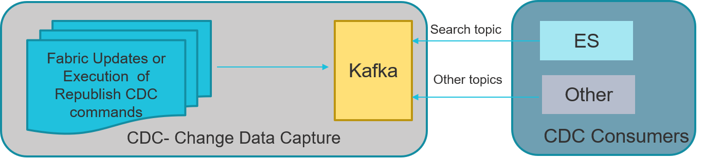

# Change Data Capture Overview

Fabric's Change Data Capture (CDC) solution notifies external systems about data changes published via Kafka and also offers cross-instance Search capabilities through its built-in integration with Elasticsearch.

For example, search all customers c

alled “John Doe” and live in “New-York”.

The following HL flow describes the CDC flow and the population of the CDC data in the consumers:

Publication of CDC changes requires  a predefined implementation on the Fabric Studio. When defining LU in the Fabric Studio, selected tables and columns can be set to publish CDC messages each time they are updated. 

Click for more information about [CDC implementation]() and [Search implementation]().

Fabric sends CDC messages to Kafka.  A specific [CDC message](02_cdc_messages.md) is generated for each type of change in the CDC column.

Fabric CDC_TRANSACTION_PUBLISHER job publishes the CDC changes to Kafka. Each consumer has its own Kafka topic.

Fabric CDC_TRANSACTION_CONSUMER job consumes the search topic from Kafka and updates the Elasticsearch.

Other consumers need to create their own consumers processes to consume their Kafka CDC messages. 

