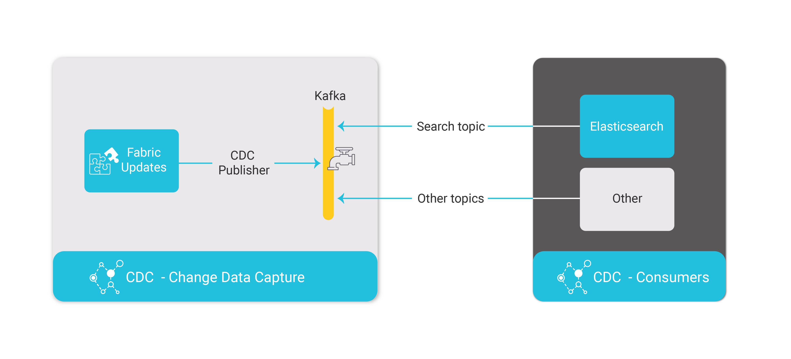

# Change Data Capture Overview

Fabric's Change Data Capture (CDC) solution notifies external systems about data changes published via Kafka and also offers cross-instance Search capabilities through its built-in integration with Elasticsearch.

The following HL flow describes the CDC flow and the population of the CDC data in the consumers:

Each CDC messages is sent to Kafka.  A specific [CDC message](02_cdc_messages.md) is generated for each type of change in the CDC column.

Fabric CDC_TRANSACTION_PUBLISHER job publishes the CDC changes to Kafka. Each CDC consumer has its own Kafka topic.

Fabric CDC_TRANSACTION_CONSUMER job consumes the Search topic from Kafka and updates the Elasticsearch.

Other consumers need to create their own consumers processes to consume their Kafka CDC messages. 

Note that a publication of CDC changes requires  a [predefined implementation](03_cdc_implementation_steps.md) on the Fabric Studio. When defining an LU in the Fabric Studio, selected columns of LU tables can be set to publish CDC messages each time they are updated. 

The LUs having CDC indexes must be deployed to Fabric to publish the CDC columns to the CDC consumers:

- When the LU is deployed to Fabric for the first time, a [CDC Schema](02_cdc_messages.md#cdc-schema) message is published to Kafka to create the CDC indexes in the CDC consumers.
- When the LU is redeployed to Fabric, a [CDC Schema Update](02_cdc_messages.md#cdc-schema-update) message is published to Kafka the schema updates on the affected CDC LU tables.

