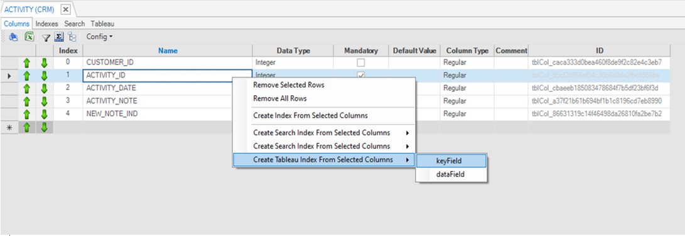

# CDC Implementation Steps

## Adding CDC Consumers

Fabric has built-in integration with Elasticsearch and can also send CDC changes to other consumers. 

The Fabric Studio can be customized. Consumers can be added for CDC fields by editing the [project name].k2proj field of a Fabric project:


1.  Right click the project name and select **Open Folder**.

2. Open the [project name].k2proj file to be edited.

3. Edit the **DataChangeIndicators** tag by adding the **DataChange** tag. By default, the **DataChangeIndicators** contains the **Search** consumer.  Set the consumer name in the **name** and set the index types of the CDC columns in the **Options** tag.  See the example below:

   ```
    <DataChangeIndicators>
       <DataChange name="Search" enabled="true">
         <Options>
           <option>keyword</option>
           <option>data</option>
           <option>date</option>
         </Options>
       </DataChange>
   	<DataChange name="Tableau" enabled="true">
         <Options>
           <option>keyField</option>
           <option>dataField</option>
         </Options>
       </DataChange>
     </DataChangeIndicators>
   ```
   
   Note that the **Search** name cannot be used for additional data change consumers since it is reserved for **ElasticSearch**. 
   
   
   
4. Save and close the .k2proj file.

5. Close and reopen your project to reload the changes in the .k2proj file.

6. Open the required LU table as a new tab added for the data change. A new tab is added for the CDC consumer defined in the .k2proj file: 

   

   

   The name of the Kafka topic added for the new CDC consumer is identical to the name of the new tab. 

    

### Creating Indexes for Other CDC Consumers


When defining LU in the Fabric Studio, selected tables and columns can be set to publish CDC messages each time they are updated. 
For example, to notify an external consumer system about a customer's change of address, the following columns are defined as CDC columns in the ADDRESS table in the CUSTOMER LU: 

-  STATE
-  CITY
-  STREET
-  HOUSE_NO
-  ZIP_CODE 

Note that Fabric Studio does not enable defining more than 63 columns as CDC fields in the same LU table, assuming that all columns are positioned according to 1 to 63 in the LU table.

A specific [CDC message](02_cdc_messages.md) is generated for each type of change in the CDC column. 


[](02_cdc_messages.md)[](04_cdc_publication_flow.md)
