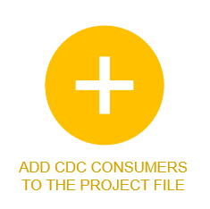
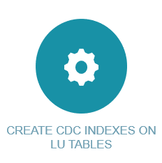

# CDC- Implementation Steps

Publication of CDC changes requires a predefined implementation on the Fabric Studio. When defining LU in the Fabric Studio, selected tables and columns can be set to publish CDC messages each time they are updated. 

## CDC Implementation- Define CDC Indexes for Other CDC Consumers

The following diagram is an overview of the main steps to create CDC indexes for other CDC consumers:

## CDC Implementation- Define Search Columns

The following diagram is an overview of the main steps to create Search indexes :

