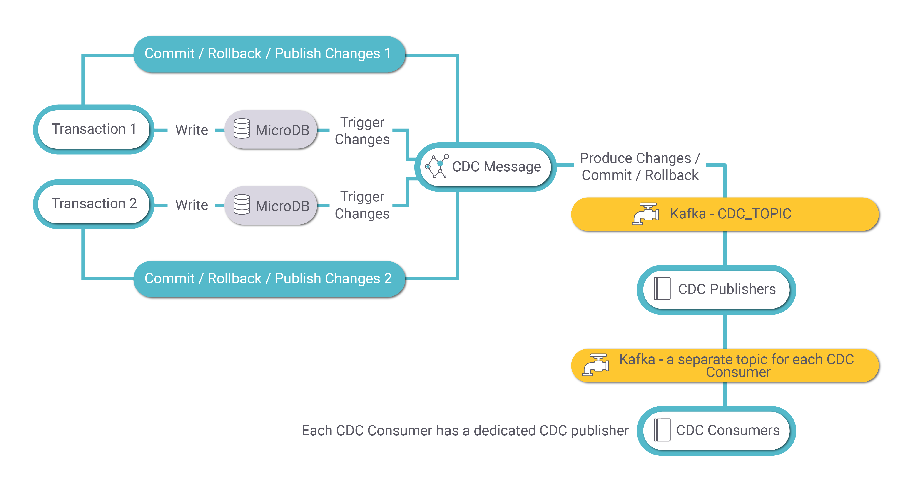
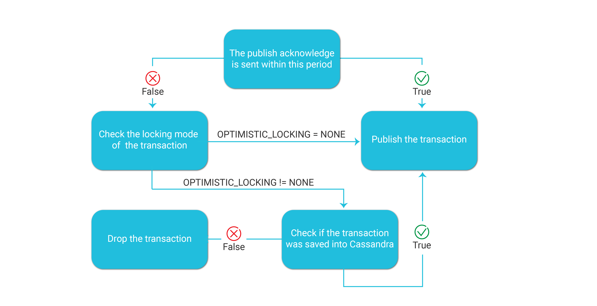

# CDC Process Architecture

Fabric CDC process aggregates data updates on the [MicroDB](/articles/02_fabric_architecture/01_fabric_architecture_overview.md#211-microdb-) of the LUI and publishes a CDC message to the CDC consumer for committed changes. 

The following diagram describes the CDC process:

[to fix the diagram- replace cdc collector by cdc message.
Add CDC consumer]

### MicroDB Update

A transaction on the LUI may involve several updates on several LU tales of the LUI. Each update (write) of the MicroDB SQLite file of the LUI, activates SQLite triggers that send the changes to the **CDC Collector**. The CDC Collector publishes a message to Kafka for each insert, update, or delete events on the MicroDB.  Each message has the LUI (iid), the event type, old and new values of each CDC column, PK columns of the LU table, and transaction id.

If the transaction is committed, a **Commit message** will be sent by the **CDC Collector**. 

If the transaction is interrupted, rollbacked,  or failed, a **Rollback message** will by sent by the **CDC Collector**. 

### CDC Message

The CDC Collector publishes transaction messages to **Kafka**  for each UPDATE, INSERT, or DELETE activity. Kafka has one topic- CDC_TOPIC - to keep the transaction messages. The partition key is the LUI (iid).

### CDC Publisher

When the MicroDB is saved into Cassandra, the thread of the transaction sends a **Publish Acknowledge**  message to the **CDC_TOPIC** of Kafka when the MicroDB is saved to Cassandra. 

The CDC_TRANSACTION_PUBLISHER job consumes the transaction messages from Kafka and creates a [CDC message](02_cdc_messages.md) on each transaction. Each CDC consumer has its own Kafka topic.

#### TRANSACTION_ACKNOWLEDGE_TIME_SEC Parameter

Fabric [confing.ini](/articles/02_fabric_architecture/05_fabric_main_configuration_files.md#configini) file defines the following parameter which sets the maximum waiting time between the commit of the transaction and the Publish Acknowledge message which is sent when the transaction is successfully saved into Cassandra: 

- TRANSACTION_ACKNOWLEDGE_TIME_SEC=60

The default value of this parameter is 60 seconds.

The following diagram displays how Fabric handles this parameter:

### CDC Consumer

Fabric has a built-in integration with Elasticsearch. The CDC_TRANSACTION_CONSUMER jobs starts automatically when deploying an LU with Search indexes.  The UID of this jobs is **Search**. The CDC consumer job consumes the messages of the  **Search** topic of Kafka and creates the search indexes in the Elasticsearch.

[Click for more information about LUI data indexing flow in the Elasticsearch].

### CDC Transaction Debug 

???

