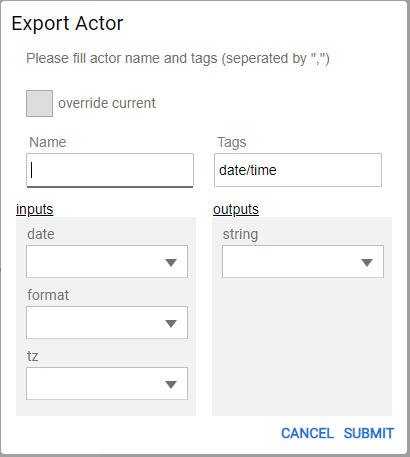

# Actor's Inheritance

In Broadway an Actor can be extended to create a new Actor type using **Export Actor** functionality. By exporting an Actor, the new Actor inherits the current Actor’s logic and arguments and extends it with additional functionality. Actor's inheritance enables the reuse of specific business logic in different flows in Broadway.  

### How Do I Export an Actor?

For example, when it is required that all dates will be formatted using the same pattern, you can set a specific pattern in the **DateFormat** Actor and then export this Actor in order to reuse it across various Broadway flows. Do the following:

1. Add an Actor to the flow and update its arguments and/or logic. For example, add a **DateFormat**  Actor and set its **format** input argument to **'E  dd-MM-yy HH:mm a'** and the time zone to **Israel**. With these settings, the **string** output argument will be displayed as **'Thu  06-08-20 15:30 PM'**.

2. Click  > **Export Actor** from the [Actor's context menu]() to open the Export Actor pop-up.

   

3. Populate the new Actor's name **myDateFormat** and the tag if you want to create a new Actor in a different category from the original Actor and press SUBMIT. 
   - The new **myDateFormat** Actor is created and it inherits from **DateFormat** Actor type.
   - **myDateFormat** Actor can be reused by any Broadway flow in Fabric.

Once the Export Actor creates a new inherited Actor, the new Actor is added to the list of Actors and can be [added to any Stage](03_broadway_actor.md#how-do-i-add-actor-to-stage) in the flow.

The Actor's input and output arguments can be filtered using the [Parameter's filter in the Properties window](03_broadway_actor_window.md#properties-overview).

 

### How Do I Modify the Inherited Actor?

The inherited Actor can be modified. There are two reasons for Actor's modification:

- To update the behavior of the exported Actor, due to the requirements change or a bug fix. 
- To extend the behavior of the exported Actor, in order to create an additional level of inheritance.

The difference between the two is whether to override the inherited Actor or not.  When we need to update the Actor, override is required. 

To override the extended Actor do the following:

1. Click  > **Export Actor** from the [Actor's context menu]() to open the Export Actor pop-up.

2. Click **override current** checkbox in the Export Actor pop-up. The name is prepopulated with the Actor's name and it is read-only.

   

3. Click SUBMIT to save the changes.

To extend the behavior of the exported Actor do the following:

1. Click  > **Export Actor** from the [Actor's context menu]() to open the Export Actor pop-up.

2. Populate a new Actor's name and click SUBMIT.

   

Note that an override option only exists for the inherited Actors. The product [built-in Actors](04_built_in_actor_types.md) cannot be overridden. 

