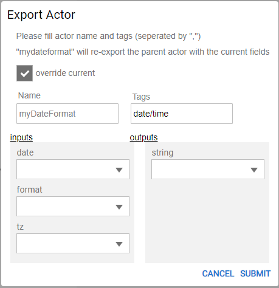

# Actor Inheritance Mechanism

A Broadway Actor can be extended to create a new Actor type using the **Export Actor** functionality. 

When an Actor is exported, a new Actor inherits its logic and arguments and also extends it with additional functionality whereby specific business logic can be reused in different Broadway flows. For example, to format all dates using the same pattern, set a specific pattern in the **DateFormat** Actor and then export the Actor to reuse it in various Broadway flows. 

During the Actor's export you can set each of its input and output arguments as hidden or final. 

* Setting an argument as **hidden**, the ancestor's argument will be hidden in the inherited Actor. For example, when an argument is irrelevant for the inherited Actor's functionality.
* Setting an argument as **final**, the inherited Actor won't be able to change the ancestor's argument value. 

This setting is optional whereas neither hidden nor final is set, the argument remains as is in the inherited Actor.

### How Do I Export an Actor?

1. Add an **Actor** to the flow and update its arguments and/or logic. For example, add a **DateFormat**  Actor and set its **format** input argument to **'E  dd-MM-yy HH:mm a'** and the time zone to **Israel**. Using these settings, the **string** output argument is displayed as **'Thu  06-08-20 15:30 PM'**.

2. Click  > **Export Actor** in the [Actor's context menu](18_broadway_flow_window.md#actor-context-menu) to open the Export Actor pop-up.

   

3. Populate the new Actor's **Name** as **myDateFormat**. 

4. Optional: override the **Tag** to create a new Actor in a new (different) category.

5. Optional: for each of input and output arguments set if it's hidden or final.

6. Click **SUBMIT**. 

The new **myDateFormat** Actor is created and it inherits from the **DateFormat** Actor type. The **myDateFormat** Actor can be reused by any Broadway flow in Fabric.

Once the inherited Actor is created, it is added to the list of Actors and can be [added to a Stage](03_broadway_actor.md#how-do-i-add-actor-to-stage) in the current or another flow.

The [Actor's input and output arguments](03_broadway_actor_window.md#properties-overview) in the Properties window can be filtered using the Parameter's filter to display only the inherited Actor's arguments, or only the ancestor's arguments or all.

### How Do I Modify an Inherited Actor?

An inherited Actor can be modified for two reasons:

- To update the behavior of the exported Actor due to changed requirements or a bug fix. 
- To extend the behavior of the exported Actor to create an additional level of inheritance.

The difference between the two reasons is whether the inherited Actor is overridden or not.  If the Actor needs to be updated, it is overridden. 

To override an extended Actor, do the following: 

1. Click  > **Export Actor** in the [Actor's context menu](18_broadway_flow_window.md#actor-context-menu) to open the Export Actor pop-up.

2. Check **override current**. The name is prepopulated with the Actor's name and is read-only.

   

3. Optional: override the **Tag** to create an Actor in a new (different) category.

4. Optional: for each of input and output arguments set if it's hidden or final.

5. Click **SUBMIT** to save the changes.

To extend the behavior of the exported Actor, do the following:

1. Click  > **Export Actor** in the [Actor's context menu](18_broadway_flow_window.md#actor-context-menu) to open the Export Actor pop-up.

   

2. Populate the new Actor's **name**. 

3. Optional: override the **Tag** to create an Actor in a new (different) category.

4. Optional: for each of input and output arguments set if it's hidden or final.

5. Click **SUBMIT** to save the changes.

Note that an override option only exists for inherited Actors. The product's [built-in Actors](04_built_in_actor_types.md) cannot be overridden. 

