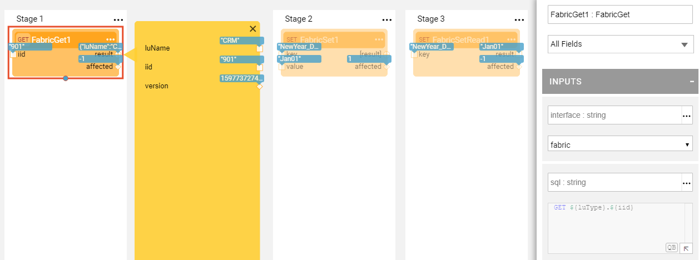

# Broadway Integration with Fabric

Broadway is the Fabric module that can run stand-alone in a Web browser or embedded in the Fabric Studio. Fabric Studio includes several integration points exposed to Broadway Actors that can simplify the creation of the Broadway flows.

### Interfaces List

Several Broadway [Actors](03_broadway_actor.md) include an **interface** as one of their input arguments. When setting the Actor's interface from the drop-down list, the list of values is retrieved from the Project Interfaces list. Only Active interfaces are displayed. The values are filtered by the Interface Type keeping only the interfaces relevant to Actor type.

* For [DB Commands Actors](actors/05_db_actors.md) the interface only displays the Fabric [DB Interfaces](/articles/05_DB_interfaces/03_DB_interfaces_overview.md).
* For [Pub / Sub Actors](actors/04_queue_actors.md) the list of interfaces is limited to Kafka or JMS interface types. 
* For [**FileRead** /**FileWrite** Actors](actors/02_stream_actors.md) the list of interfaces includes only the local file system interface types. 

Note that the list of values in the Actor's **interface** drop-down list includes also the custom values applicable for the Actor type that are not coming from the Project interfaces. For example, **custom url**. 

### Table Selection and Query Builder

The input arguments of the [DB Commands Actors](actors/05_db_actors.md) include the integration to the Fabric windows which enable the simplification of the queries creation and validation. 

To populate the SQL statement on **DbCommand** Actor, do the following:

* Set the **interface** input argument, then click the **QB** button in **sql** input argument field.  The [Query Builder window](/articles/11_query_builder/02_query_builder_window.md) will open filtered by the selected DB Connection.
* Click on the required table and the fields or write the query manually and press Execute Query to validate it. After the query is validated, press OK. The SQL statement is populated in the **sql** input argument of **DbCommand** Actor.

To set the table and the fields on **DbLoad** Actor, do the following:

* Set the **interface** input argument, then click the **DB** button in **table** input argument field.  Table Selection popup window will open filtered by the selected DB Connection.
* Click on the required table and press OK. The table name and the columns are populated in the **table** and the **fields** input arguments of **DbLoad** Actor.

<table>
<tbody>
<tr>
<td valign="center" ></td>
<td valign="center" ></td>
</td>
</tr>
</tbody>
</table>

### LuFunction and Graphit Actors

**LuFunction** and **Graphit** are two [built-in Actors](../04_built_in_actor_types.md) which fully utilize the Fabric integration with Broadway and enable the reuse of the Fabric logic within Broadway flows. 

To do so, set the [Logical Unit](/articles/03_logical_units/01_LU_overview.md) in the **luType** input argument and then select a [Project function](/articles/07_table_population/08_project_functions.md) or a [Graphit](/articles/15_web_services_and_graphit/17_Graphit/01_graphit_overview.md) resource. 

Note that the **luType** input argument includes the list of all Logical Units in the Project including the [Web Services](/articles/15_web_services_and_graphit/01_web_services_overview.md) and the References.

#### LuFunction Actor

**LuFunction** Actor is used when a Fabric [Project function](/articles/07_table_population/08_project_functions.md) needs to be invoked from a Broadway flow. This is also the way to write the business logic in Java rather than in JavaScript in Broadway. 

After the **luType** input argument is set, the list of values in the **functionName** drop-down will be filtered by the LU name. It will display the functions of the selected LU and the Shared Object's functions. The Actor's input and output arguments will be updated with the inputs and output of the selected function.

#### Graphit Actor

The purpose of **Graphit** Actor is to execute Graphit logic for data serialization. Parameters to the Graphit execution are picked up from input arguments or, if not there, from the **params** input argument.

After the **luType** input argument is set, the list of values in the **graphit** drop-down is filtered by the LU name. The Actor's input and output arguments are updated with the inputs and output of the selected Graphit resource.

### Fabric Commands Actors

Broadway provides the **fabric** category of [built-in Actors](../04_built_in_actor_types.md) which purpose is to execute the Fabric commands. 

* **FabricGet** Actor executes the GET command on the current Fabric session.
* **FabricSet** Actor sets a value on the Fabric session.
* **FabricSetRead** Actor reads a key from the Fabric session.

The **interface** input argument of the Actors should include [Fabric or Fabric Remote interface type](/articles/05_DB_interfaces/05_adding_a_fabric_and_remote_fabric_interface_type.md). 
The **sql** input argument displays the command to be executed on the Fabric interface. This argument is read-only and it contains named params using ${} notation. 

For example, **FabricGet** Actor displays the command:

~~~ java
GET ${luType}.${iid}
~~~

Where **${luType}** and **${iid}** are replaced by the values of the input arguments in the prepared statement. 

Set the [Logical Unit](/articles/03_logical_units/01_LU_overview.md) in the **luType** input argument of the Actor and type the [Instance ID](/articles/01_fabric_overview/02_fabric_glossary.md#instance-id) in the **iid** input argument.

### Broadway as a Population

Broadway flow can be used as a [Table population](/articles/07_table_population/01_table_population_overview.md) replacing the complex Java code in the population logic by the [Stages](19_broadway_flow_stages.md) and [Actors](03_broadway_actor.md) in the flow. 

To create the population based on the Broadway flow, right click the table name in the Project Tree and select **New Table Population Based Broadway Flow**. The population template is created and can be modify as needed.

### Interface Listener For Broadway Flows

Interface Listener functionality is the enhancement of the Fabric Jobs which allows to define SFTP or a local file system listener for a Broadway flow. The Listener Job is attached to a Broadway flow and when a file with the predefined path arrives to the predefined interface, it triggers the flow.

