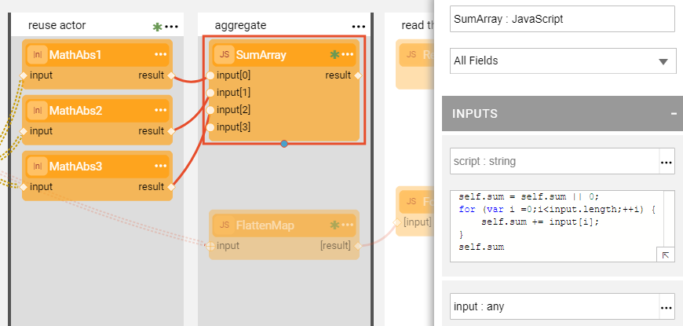

# JavaScript Actor

### JavaScript Actor Overview

The **JavaScript** Actor is an important and useful [built-in Actor type](04_built_in_actor_types.md) that can be used to simplify a flow by writing JavaScript business logic or validation code in the **script** input parameter.

There are no limitations on the number of rows in an Actor. However, to improve the usability of an Actor and an entire flow, we recommend writing only short sections of JavaScript code.

The **javascript.flow** and **javascript-advanced.flow** examples shows various ways to use a **JavaScript** Actor in a flow.

Click **Actions** > **Examples** in the [Main menu](18_broadway_flow_window.md#main-menu) to open the examples. 


### Special Keywords and Conventions

- The return value of a **JavaScript** Actor is the last expression in the **script** input parameter. The **return** keyword does not need to be written in the script since the **result** output parameter can be used to read the Actor's result. For example, when the following code is written in the **JavaScript** Actor, the value of **rowSum** is returned. 

  ```
  var rowSum = 0;
  for each (var col in row) { 
   rowSum += col;
  }
  rowSum;
  ```

- Use the [**self** keyword](08_javascript_actor.md#example-of-how-to-sum-the-values-of-an-array) to maintain a state across script executions, such as a loop aggregation. For example: 

  ``` self.agg += value ```

- To [read data from completed Actors](08_javascript_actor.md#example-of-how-to-access-data-of-completed-actors-in-the-flow), access their ID as a local variable and read the output ports. For example, use **Const1.value** to access the value of an Actor named Const1.

- To access iteration data, use the **contextLoop** object to access **contextLoop.index()**, **contextLoop.stop()** or **contextLoop.skip()**.

- To read and write data to the flow's arguments, use the [**flowArgs** keyword](08_javascript_actor.md#example-of-how-to-read-and-write-data-to-the-flow-arguments). You can also use **flowArgs** to write data to the flow's context and refer to it in other Actors.

- To iterate over a collection, use standard syntax: 

  ``` rows.forEach(row => {...}) ```

- The [**for...each** syntax](08_javascript_actor.md#example-of-how-to-use-foreach-syntax) is also supported: 

  ``` for each (var row in rows) { ... } ```

- To write to the log at INFO level, use **print()**. For example:

  ``` print("The value of Const1 is: " + Const1.value) ```

- An error should be communicated by throwing an exception. For example: 

  ``` throw "Invalid Data Received" ```

### Code Examples

#### **Example of Summarizing the Values in an Array**

To summarize the values of an array, use the **self** keyword to access the Actor's state. The state is maintained between the executions of the same Actor in the flow. For example, when the **SumArray** Actor is invoked in an [Iteration](21_iterations.md) in the flow, its JavaScript code is executed across all the Actor's executions.



```  
self.sum = self.sum || 0;
for (var i =0;i<input.length;++i) {
    self.sum += input[i];
}
self.sum
```

#### **Example of Using For...Each Syntax**

**For...each** is a syntax extension that enables JavaScript to iterate over an Iterable instance.

```
var sum = 0;
for each (var i in input) {
    sum += Math.abs(i);
}
sum;
```

#### **Example of Accessing Data of Completed Actors in the Flow**

The **JavaScript** Actor can access the data of previous Actors in the flow. For example:

 ```SumArray.result == ForEach.result && ForEach.result == 21 ```

where the **SumArray** and **ForEach** Actors precede the current Actor in the flow.

#### **Example of Reading and Writing Data to Flow Arguments**

The **JavaScript** Actor can be used to read the values of a flow argument using **flowArgs** and to then override or remove them.

```
    for (var i in flowArgs) {
        print(flowArgs[i]); //read the value
        flowArgs[i] = null; //remove the value
    }
    print(flowArgs.v3); //read the value of argument v3
```

[](07_stream_actors.md)[](09_parsers_actors.md)
