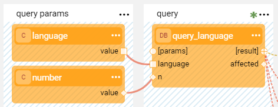
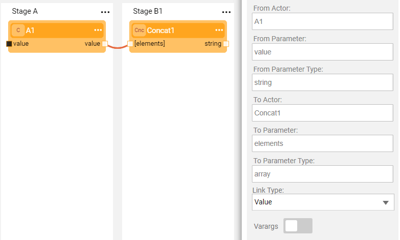
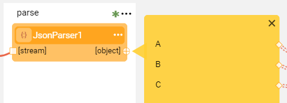

# Broadway Flow - Linking Actors

**A Broadway Flow** is a main Broadway object that represents a business process. A flow has several [Stages](16_broadway_flow_overview.md) where each Stage includes one or more [Actors](03_broadway_actor.md). Stages are executed consecutively from left to right whereas the Actors in each Stage of the flow are executed top-down.

Each actor has [data input and output parameters](03_broadway_actor_window.md#actors-inputs-and-outputs). Input parameters can be populated  by either a:

- **Link**, which gets an input value as an input parameter from another Actor.
- **Const**, a constant value that is set for the parameter.
- **External**, which gets an input value as a parameter from an external process that executes the Broadway flow.

The output of a source Actor can be linked to the input of a target Actor that runs after the source Actor.

Note that an Actor can only be linked to input parameters with Population Type = **Link**.

**Example 1: Valid Link**

Two **Const** Actors are linked to a **DbCommand** Actor and send input for a DB query.



This link is valid since the source Const Actors run before the target DbCommand Actor.

**Example 2: Invalid Link**

A **Const** Actor named FileName sends the file name as a parameter to the **FileRead** Actor and the source **Const** Actor runs **after** the target FileRead Actor:


## Link Object Properties

A link holds the following settings:

<table width="900pxl">
<tbody>
<tr>
<td valign="top" width="300pxl"></td>
<td valign="top" width="600pxl">
<ul class="unchanged rich-diff-level-one">
<li class="unchanged">
<p class="unchanged"><strong>From (source) parameters</strong>, From Actor, From Parameter and From Parameter Type. These parameters are read-only parameters and cannot be edited.</p>
</li>
<li class="unchanged">
<p class="unchanged"><strong>To (target) parameters</strong>, To Actor, To Parameter and To Parameter Type. These parameters are read-only and cannot be edited. Note that Broadway attempts to handle the differences between the source and target types. For example: if the source type is Integer and the target type is String, then Broadway casts the source integer to a String.</p>
</li>
<li class="unchanged">
<p class="unchanged"><strong>Link Type</strong>, can be edited to set one of the following link types:</p>
<ul class="unchanged">
<li class="unchanged">
<p class="unchanged"><strong>Value</strong>, (default option). Sends the value of the parameter.</p>
</li>
<li class="unchanged">
<p class="unchanged"><strong>Iterate</strong>, opens a loop on the transferred parameter. When set, the link line is displayed as a double-dashed line. Note that if an array is linked to an output with a single element of the same type - for example, linking an array of string to a string output - the link is created automatically with an <strong>Iterate</strong> link type.</p>
<p class="unchanged"><a href="21_iterations.md">Click for more information about handling loops.</a></p>
</li>
<li class="unchanged">
<p class="unchanged"><strong>First</strong>, sends the first value of the parameter. For example, sends the first record of the result set.</p>
</li>
</ul>
</li>
<li class="unchanged">
<p class="unchanged"><strong>Varargs</strong> (variable arguments). When set to ON, the target Actor accepts an arbitrary number of values by updating the target parameter to an array and linking each source parameter to a different element in the array. This can be useful for building a variable length array on-the-fly. For example, the <strong>Concat</strong> Actor that can be used to concatenate several values into a single string using the Varargs setting.</p>
</li>
</ul>
</td>
</tr>
</tbody>
</table>

**Example of Varargs Setting**

In a flow there may be a need to concatenate several strings into a single string. For example, to format an address string from separate address elements. This can be implemented using the **Varargs** setting.

- Link the **A1** Actor to the **Concat1** Actor with Varargs set to OFF. 

    

- Update the Varargs setting to ON. This modifies the **elements** input variable to an array that holds two elements - the first is linked to the **A1.value** and the second is available for an additional link:

  


- Linking the **B1.value** to the second element in the **elements** array again adds an element to the **elements** array and enables linking additional inputs to it:

  


  **Notes:**

  - The number of strings that can be concatenated is unlimited. 
  - All additional links to the target array are created automatically when **Varagrs** is set to ON.
  - When the Varargs of one of these links is set to OFF, the target array returns to its original type as created by Varargs and removes other links to this target parameter.


## How Do I Add Links to the Flow?

To create a **Link**, do either:

- Click the **output parameter** of the source Actor and drag the **connection line** to the **input parameter** of the target Actor.
- Click the **input parameter** of the target Actor and drag the **connection line** to the **output parameter** of the source Actor.
- Click  in the source [Actor's context menu](18_broadway_flow_window.md#actor-context-menu) > **Link**. Populate the **Target Actor**, **Target Parameter** and the **Selection Parameter** (source parameter) and then click **V** to save the changes. It is recommended to use this option when the Actors are far from each other in the flow.

   

### Linking a Schema Object

A Schema contains different elements.

**Example:**

The source parameter holds the following Schema:

```
{
    "type": "object",
    "properties": {
        "name": {
            "type": "string"
        },
        "family_name": {
            "type": "string"
        },
        "age": {
            "type": "integer"
        },
        "car": {
            "type": "string"
        }
    }
}
```

To connect a specific element in the Schema, click  adjacent to the Actor's output argument to expand the **yellow segment** of the **Data Inspection** and view the parameters list in the object:



 To link a Schema to a target Actor, do either:
- Click the parameter name in the **Data Inspection** and drag the **connection line** to the **input parameter** of the target Actor.
- Click  in the right corner of the Actor to open the [Actor's context menu](18_broadway_flow_window.md#actors-context-menu) and select **Link**. Populate the **Target Actor**, **Target Parameter**, **Selection Parameter** (source Schema parameter) and **Selection Schema** (parameter name in the source Schema). Click **V** to save the changes.

    

A Schema can be connected to another Actor. For example, connecting the output Schema to the **params** input parameter of the **DbLoad** Actor. Note that if a specific element of the Data Inspection object is connected to another input parameter of the **DbLoad** Actor, the specific link overrides the link of the Schema to the **params** input parameter.  

## How Do I Remove Links from the Flow?

Click the link's connection line and press **Delete** on your keyboard.

## How Do I Edit Links in the Flow?

Click the link's connection line to open the [Link Object Properties window](20_broadway_flow_linking_actors.md#link-object-properties) on the right of the Flow window. Edit the **Link Type** or **Varargs** settings.

## Show Only Connected Objects

Click  > **Show only connected** in the [Actor's context menu](18_broadway_flow_window.md#actors-context-menu) to display only Actors linked to this Actor.
Click **Show only connected** again to remove this filter and display all Actors in the flow.

This option is useful when tracking complex flows.

**Example:**

A complex string handling flow:


To view only the  Actors connected to the **Regex1** Actor, click  in the Actor's right corner > **Show only connected** . The following Actors are displayed:


[](19_broadway_flow_stages.md)[](21_iterations.md)

