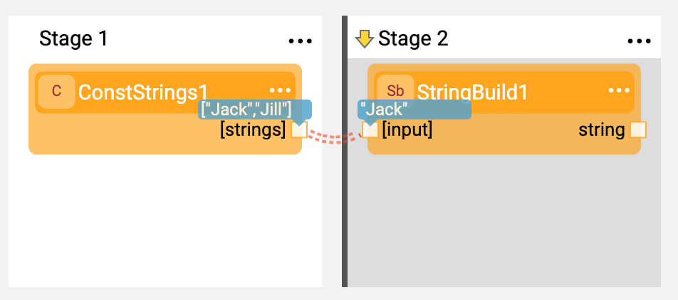

# Iterations
Iterations can be used to to repeatedly perform a section of a flow in a  data set. Iterations are similar to a **for...each loop** in the sense that a logic is repeatedly run until no data remains to act upon.
The most common iteration use cases are iterating over a database result set or an array of data returned by an API.

## Iterable Line Type

To start the iterable logic, select the line at the beginning of the loop and change the [Link Type](20_broadway_flow_linking_actors.md#link-object-properties) to Iterable. The line is now double-dotted, the background of the loop's scope is highlighted grey and a thick divider line is displayed at the starting point.

In the following image, Stage 2 runs on each data entry returned by the Actor at Stage 1.

## Scope of Iteration

The scope of the iteration's logic starts immediately after the Iterate line type's origin Actor and continues until the end of the flow or until the **Iterate Close** Stage. To mark an iteration Stage as Closed, click  in the [Stage context menu](18_broadway_flow_window.md#stage-context-menu) >  **Iterate Close**.

The following image displays an iteration loop that starts in Stage 2 and runs until Stage 3 on each entry. After the data is traversed, the loop is complete and Stage 4 is executed.

## Complex Objects and Paths

Path connections work well when combined with an iteration loop. The following displays an iterate connection selecting a field in a database result set and iterating over it.

## Nested Arrays

Looping an item in an inner array of a data set with nested arrays generates an interation over the entire data set. For example, in a data set of the **[names]** map holding an array of maps with a Broadway field name, Broadway traverses all **name** values.

## Nested Iterations

Iterations can also be nested. For example, a value in an iteration can be used as an input for another iteration. The depth of the iteration is highlighted in shades of grey. To limit the loop's scope using **Iterate Close**, add a closing Stage to each level of the loop.
There are no limitations on the iteration nesting level. However, to make a flow more readable, consider limiting a flow to 3-4 nesting levels and using [Inner Flows](22_broadway_flow_inner_flows.md) when more are needed.

In the following image, the first name is an input to a query that gets a list of relevant phone numbers. Stage 2 is run on every entry in Stage 1 and Stage 3 on every entry in Stage 2.

## Split Iterations

A Stage can have more than one collection. A common case is a JSON data structure that contains more than one array.
Using the Stage Split functionality you can split the flow and manage several loops over the same data structure.

## ForLoop Actor

The **ForLoop** Actor can be used to create a virtual data set of integers in a given range. This enables creating a loop that runs N times over a synthetic data set and is useful for repeat iterations when there is no data set to traverse.

## Programmatic Control

The Broadway Context object enables an Actor to programmatically access and control the loop using the Loop interface.
A Loop Context object can be accessed via the **Context.loop()** method in Java or using the **contextLoop** instance in JavaScript.

The following methods are supported:
* **Loop.stop()**, stops the current loop and continues execution after the loop. All Actors in the same Stage as the calling Actor are still invoked.

* **Loop.skip()**, skips the current loop iteration and continues to the next data entry. All Actors in the current Stage are still invoked.

* **Loop.index()**, returns the current loop index. The index of the first iteration = 0.

In a nested loop, you can only access the inner-most (deepest) loop that is running in the current Stage.

For more information, refer to the iterate-for-each.flow Broadway example.

