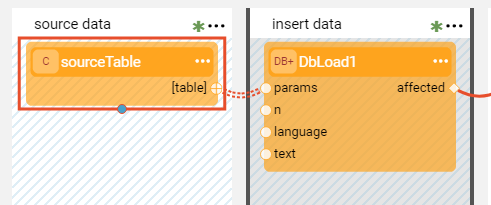

# Transactions

Broadway has a built-in Transactions Management mechanism which handles the transactions over one or more resources. The transactional resources are defined by the Fabric [Interfaces](/articles/05_DB_interfaces/01_interfaces_overview.md) and can be shared or non-shared.

* Using a **shared** resource in a flow, the connection is opened only once within the same transaction, when the first Actor is calling this resource. All other Actors will use the same connection. The examples of shared resources used by Broadway are DB Interface, file system or SFTP.
* Using  a **non-shared** resource, the connection is established each time when an Actor is calling the resource in the flow. The example of a non-shared resource used by Broadway is HTTP. 

A transaction can be defined on DB-related activities as well as on different types of entities. For example, writing into a file. When a Broadway flow writes into a file, the end transaction closes the file. 

### Transaction Definition

- The transaction starts when the [Actor](03_broadway_actor.md) in the first [Stage](19_broadway_flow_stages.md) marked as a transaction requests to start a connection. 
- Several sequential Stages marked as transactions are part of the same transaction.
- The transaction ends after the last Stage marked as a transaction and is followed by a commit (or by a rollback if there are errors). 

### Inner Flows Behavior

Transactions can include [inner flows](22_broadway_flow_inner_flows.md). If a transactional Stage executes an inner flow, it automatically becomes a part of the outer transaction and it can use a shared resource of the outer transaction.

When the outer flow starts the transaction and then invokes an inner flow, the inner flow does not close the transaction. The transaction will be closed by the outer flow.

### Iterations Behavior

There can be two transactional approaches within the iterations in Broadway: 

* To close the transaction and perform commit only after the loop over the data set is completed.

  

* Or, to close the transaction and commit on each iteration. In this case, empty Stage 3 is required to indicate that the transaction of **Iterate on array** Stage is finished before the iteration is closed.

  

### Stage Conditions Impact on Transaction

If the flow is split into several branches, the transaction can be defined per each branch and it will be a separate transaction per branch. 

When a [Stage condition](19_broadway_flow_stages.md#what-is-a-stage-condition) is not met in the transactional Stage of the flow, the transaction ends with a rollback and the execution of its branch stops. Other branches can be still executed as per the flow logic including their respective transactions.

### Error Handling Impact on Transaction

When an [Error Handler](24_error_handling.md) is defined in the transactional Stage of the flow and it catches an error, the transaction ends with a rollback and the flow execution stops. The error message displays the failure reason.

### How Do I Mark or Unmark a Stage as a Transaction?

In a Broadway flow window, a **Transaction** is marked by blue diagonal lines in the Stage's background and can span across several [Stages](19_broadway_flow_stages.md).

<table>
<tbody>
<tr>
<td valign="center" ><strong>To mark</strong> a Stage, click  > Transaction.</td>
<td valign="center" ><strong>To unmark</strong> a Stage, uncheck Transaction.</td>
</td>
</tr>
<tr>
<td valign="center" ></td>
<td valign="center" ></td>
</td>
</tr>
</tbody>
</table>

