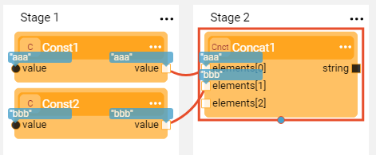
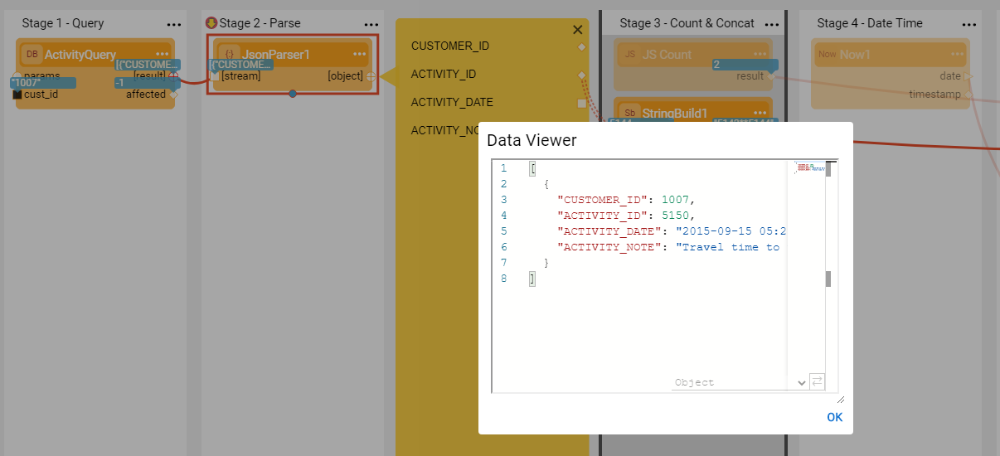
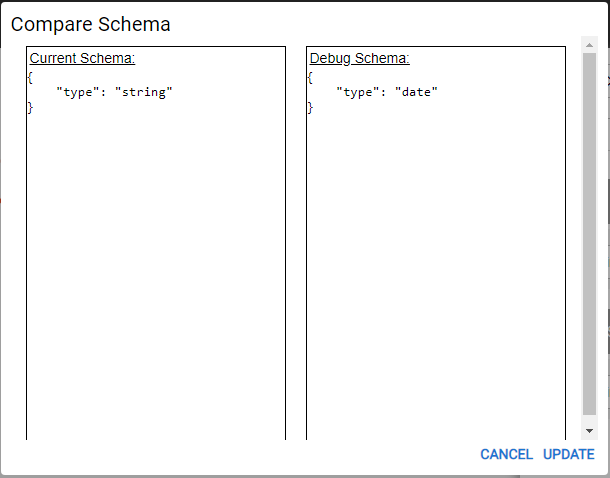
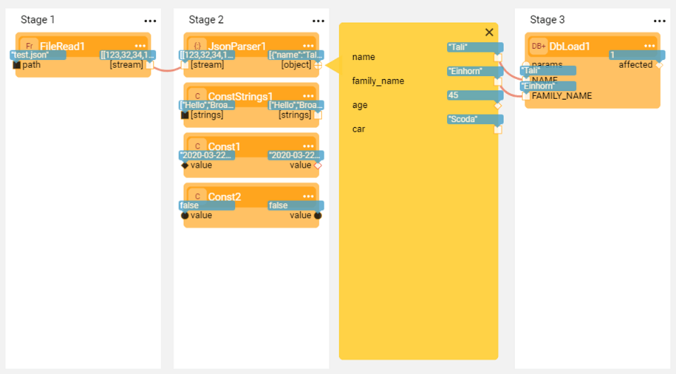

# Run and Debug Broadway Flow

### Setting Run and Debug Arguments
Prior to running or debugging a flow, set the types and values of input arguments that have an **External** [population type](03_broadway_actor_window.md#actors-inputs-and-outputs). Once they are set, the types and values are saved to the flow's cache. 

1. Click **Actions** > **Debug / Run Arguments** in the [Main menu](18_broadway_flow_window.md#main-menu) toolbar to open a window displaying a list of external input arguments.

2. Select the **Type** of each input argument.

   

3. Set the **value** of each input argument. The value's format is defined by the selected argument type.

   <table>
   <tbody>
   <tr>
   <td>

</td>
   <td>

</td>
   </tr>
   </tbody>
   </table>

4. Click **OK** to save the types and their values.

### Running and Debugging a Broadway Flow

A Broadway flow can be executed from the [Main menu](18_broadway_flow_window.md#main-menu) of the flow's window by either:

- Running the entire flow and displaying the results.
- Debugging the flow by adding break points. Debug can only be performed when Debug is ON.

Running the flow or debugging it saves a local copy of the flow in the Fabric project. If the changes have been made in the flow, they will be automatically saved even if they have not been explicitly saved. For example, when a [Tutorial flow](17_tutorial_and_flow_examples.md) is run or debugged, a local copy of the flow is saved in the Fabric project.

To run the flow, click **Run Flow**  to run the entire flow and display the results. 

- If the Debug is ON , the flow can be debugged.

- If the Debug is OFF , the flow cannot be debugged.
  

If the break points have been added to the flow, the flow stops at the first break point. Note that when a flow contains an inner flow and it has break points, the flow stops at the inner flow's break points too.

  - Click **Resume Debug**  to continue the flow from where it stopped.

- Click **Debug Step** to debug the current step and move to the next step.

To stop the flow, click **Stop Run**  to stop the flow run.

When Debug is ON, the flow can be debugged when invoked by any Fabric entity and not necessarily by another Broadway flow. For example, when invoked by a Job.

### Displaying Input and Output Data During a Debug

When Debug is ON, the values of the input and output arguments of each executed step are displayed in blue balloons.

To view a step's data, click the blue balloon to open the data and its displayed format. To set another data display format, click the format and make your selection.

### Updating a Schema

The Broadway Debug process *learns* the Schema of complex output parameters and can suggest how to update it based on a parameter's value.

When debugging an Actor with a complex output parameter, the parameter port is red:

  

1. Click the **parameter's port** (red) to open the Compare Schema window.

  

2. Click **Update** to update the output parameter's Schema. To open the [Data Inspector](27_broadway_data_inspection.md), click  adjacent to the Actor's output argument. The **yellow segment** is expanded and displays the Schema on the left and the data values on the right.

3. [Link](20_broadway_flow_linking_actors.md) the output parameters of the Schema to another Actor.

  

