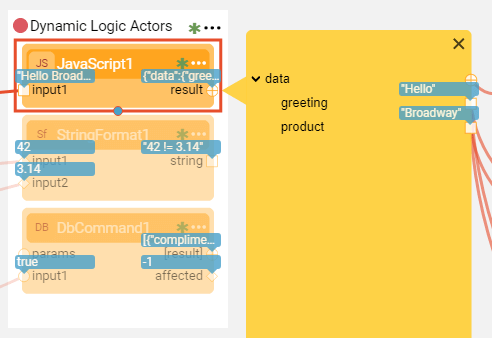
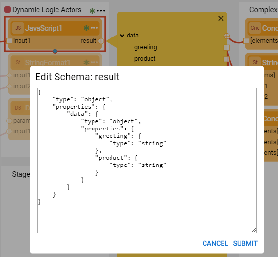

# Broadway Data Inspector

The Broadway **Data Inspector** is used to identify and display complex **Object** data type structures, their Schemas and the values that are transferred between two Stages. 

To open the Data inspector, click  adjacent to the Actor's output argument to expand the **yellow segment** and display the Schema on the left and the data values on the right. To display the data values, [debug the flow](25_broadway_flow_window_run_and_debug_flow.md#debug-broadway-flow). 

### How Do I Edit the Schema Using the Data Inspector?

A Schema can be edited during runtime. To do so, click the yellow segment next to the Schema element which you want to edit to open the context menu. 

<table style="width: 900px;">
<tbody>
<tr>
<td rowspan="7" width="410pxl">

</td>
<td width="60pxl">Add Child</td>
<td width="430pxl">

Add a child to the selected element using the <strong>Field Type Editor</strong>. The Field Type Editor is available in the <a href="18_broadway_flow_window.md#main-menu">Main menu</a> area and can be used to define the new element's Name and the Type.

Note that <strong>Add Child</strong> menu item is available in the context menu when clicking on the parent node.

</td>
</tr>
<tr>
<td width="200">Add Sibling</td>
<td style="width: 465px;">

Add a sibling to the selected element using the <strong>Field Type Editor</strong>.

</td>
</tr>
<tr>
<td width="200">Edit</td>
  <td style="width: 465px;">Edit the element's name or type using the <strong>Field Type Editor</strong>.</td>
</tr>
<tr>
<td width="200">Delete</td>
<td style="width: 465px;">Delete the element from the Schema.</td>
</tr>
<tr>
<td width="200">Move Up</td>
<td style="width: 465px;">Move the element up the Schema.</td>
</tr>
<tr>
<td width="200">Move Down</td>
<td style="width: 465px;">Move the element down the Schema.</td>
</tr>
<tr>
<td width="200">Link</td>
<td style="width: 465px;">Link the element to a target Actor using the <strong>Field Type Editor</strong>.</td>
</tr>
</tbody>
</table>

### How Do I Edit the Schema Using the Editor?

Additional way to edit the schema is using the Schema editor. To do so, click **Edit Schema** in the output argument's properties to open the **Edit Schema** window. Edit the Schema manually and then click **Submit** to refresh the yellow segment and update the Schema. 

