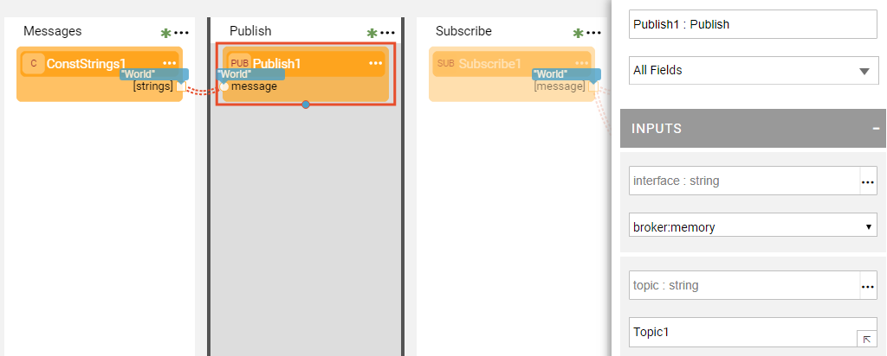

# Queue Actors - Pub/Sub

### Pub/Sub Overview

Broadway provides a group of [built-in Actors](../04_built_in_actor_types.md) to manage Pub/Sub asynchronous message handling. These Actors are:

- **Publish** Actor, publishes messages using a message broker.
- **Subscribe** Actors, subscribes to messages provided by a message broker.
- **SubscribeBatch** Actors, same as **Subscribe** but it can read the messages in batches. 

The message provider must be defined as Fabric [Interface](/articles/05_DB_interfaces/01_interfaces_overview.md) and set in the **interface** input argument of the Pub/Sub Actors. The supported message provider types are:

* Kafka.
* JMS Queue and Topic by any JMS provider (for example, RabbitMQ or Active MQ).
* Broker memory (in-memory queue), a Fabric internal queue which doesn't have any partitions and manages the messages using the key.  

The message type to be processes by Broadway Pub/Sub must be aligned with the Interface **Data type** and is limited to: String, byte[], JSON, long. The message type of in-memory broker is not limited to any specific types.

The input arguments of Pub/Sub Actors correspond to the functionality of the supported providers whereby some of the input arguments are relevant only for Kafka and some - only for JMS. For example, **key** input argument of the **Publish** Actor is relevant for Kafka only and it is the key commonly used for partitioning. The **correlation_id** input argument is only used by JMS publishers. This is a unique identifier that correlates the request message and its reply. In case left empty, the server will generate one. 

The arguments that are not supported by the message provider can be left empty and will be ignored. For example, the batch size is set by **max_batch_records** input argument. However this parameter is ignored by interfaces that do not support batches (such as JMS) considering all batches having a size of 1.

The **topic** and few other input arguments (such as **group_id**) can be left empty in case a default topic was configured on the interface. However when a value is defined in the Actor, it will be used in the flow rather than the value defined on the interface. 

The **Subscribe** Actor should always listen to the same topic. The **Publish** Actor can send messages to different topic thus the **topic** argument of the Actor can be overridden during the flow.

### Timeout Setting

The **Subscribe** Actor has two timeout related settings:

* poll_timeout, the timeout to wait for a new message or the first message in a batch. If the timeout elapses the collection will come to an end. If set to -1 the wait will be forever.
* batch_timeout, the duration the system will wait to accumulate messages in a batch. After the first message, the system accumulates additional messages until the batch_timeout is encountered or the batch is full (max_batch_records). If the timeout elapses, the system will return a batch with the available messages (at least 1 but not more than max_batch_records).

When debugging the flow, the **Subscribe** Actor waits only 1 sec in order not to stuck the [Debug run](../25_broadway_flow_window_run_and_debug_flow.md).

In a regular run the timeout can be controlled by setting it to the required elapsed time and even can be set to -1, meaning an infinite wait for messages.

### Acknowledgement in Broadway Pub/Sub

In a [Transaction](../23_transactions.md) the acknowledgment is performed upon commit. 

If not in Transaction, the acknowledgement is performed only on the next  message. Meaning that if the server fails after reading the message, the same message will be processed again.  

### Pub/Sub Examples 

Check out **message-broker-pubsub.flow** for Pub/Sub examples. To do so, go to **Actions** > **Examples** in the [Main menu](../18_broadway_flow_window.md#main-menu).

The following part of the example flow shows how to publish few messages to an in-memory queue using a **Publish** Actor and then read them from a queue using **Subscribe** Actor.

To read the messages in batches, use **SubscribeBatch** Actor and define **max_batch_records** to the required batch size.

